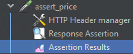
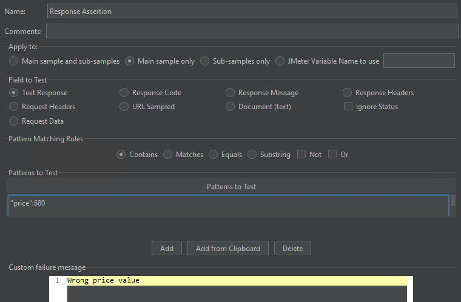
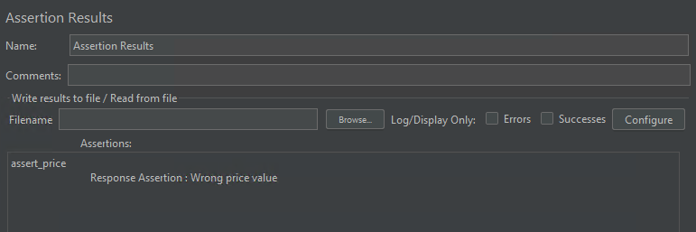
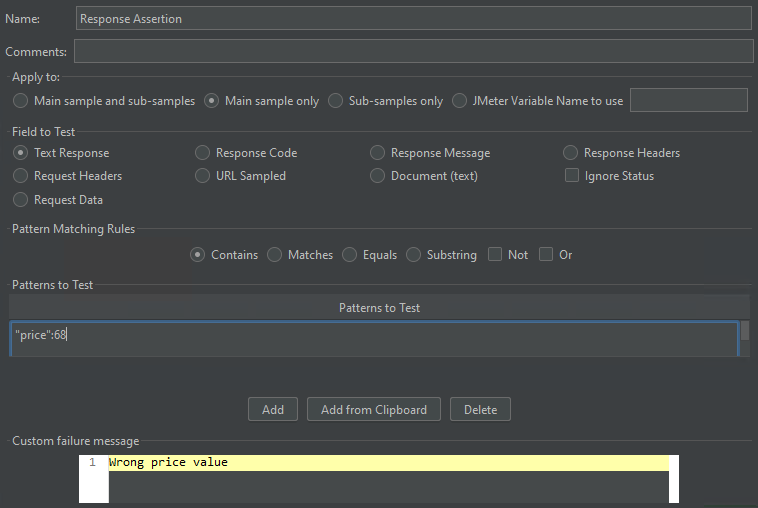
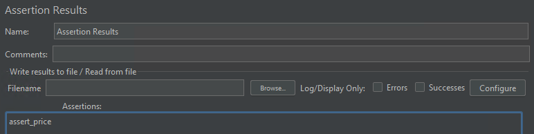

# Lab 13
## [Apache JMeter file](website_testing.jmx)

## Highlights:

Checking price value for a product.\

### Testing response with wrong price pattern:

### Testing response with correct price pattern:

